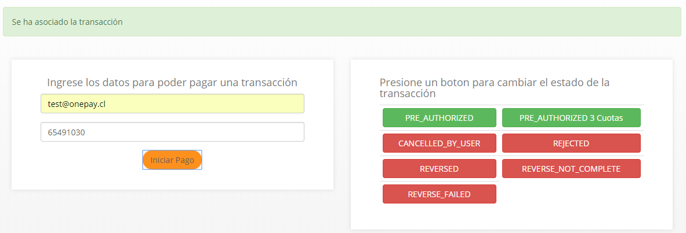

# Proyecto de ejemplo para uso de Onepay con el SDK de Transbank para PHP

El siguiente proyecto es un simple ecommerce el cual utiliza Onepay a través del
SDK de Transbank para PHP,  mostrando ejemplos de como crear una transacción (_Transaction_::create), como confirmarla
(_Transaction_::commit) y como anularla (_Refund_::create)

## Requerimientos
Para ejecutar el proyecto es necesario tener: 
 ```docker``` y ```docker-compose``` ([como instalar Docker](https://docs.docker.com/install/))

## Ejecutar ejemplo
Con el código fuente del proyecto en tu computador, puedes ejecutar en la raíz del proyecto el comando para construir el contenedor docker, si es la primera vez que ejecutas el projecto:
```bash
docker-compose build
```
Luego, es necesario instalar las dependencias:
```bash
docker-compose run web composer install
```
Finalmente, para correr el projecto de ejemplo:
```
docker-compose run --service-ports web php artisan serve --host=0.0.0.0 --port=8000
```
También puedes iniciar el proyecto simplemente ejecutando el archivo `run.sh` en la raíz del proyecto

En ambos casos el proyecto se ejecutará en http://localhost:8000 (y fallará en caso de que el puerto 8000 no esté disponible)

Es posible ver las operaciones del SDK implementadas en la clase TransactionController,
la cual esta en [Transaction.php](./app/Http/Controllers/Transaction.php)

Asimismo, es posible ver la utilización del SDK de JavaScript en el archivo [use-onepay.js](./public/js/use-onepay.js)

El proyecto incluye, en su raíz, un archivo .env con valores para `ONEPAY_SHARED_SECRET`  y `ONEPAY_API_KEY`, los cuales son útiles para poder hacer pruebas.

Este proyecto está hecho en PHP 7.2 utilizando Laravel 5.6

## Compra de prueba
1. Desde la tienda de ejemplo.
2. Clic en el botón `Pagar con Onepay`
3. Esperar a que se genere un nuevo código QR.
4. Utilizando un lector de QR puedes identificar el OTT (identificador simplificado y único de la transacción) que se utiliza en el simulador de pago.
5. Pagar/Rechazar utilizando el simulador de pagos

## Simulador de pagos.
Este simulador permite realizar pruebas de **pagos** y **rechazos** con distintos códigos, simulando las acciones del usuario en la aplicación de **Onepay**. 

Este simulador apunta al ambiente de Prueba que puede ser configurado siguiendo las instrucciones provistas en tu SDK/Plugin

1. La URL es: https://onepay.ionix.cl/mobile-payment-emulator/


2. Una vez te registres como comercio con Transbank, tendrás tus propios datos de prueba, sin embargo, si quieres comenzar a probar antes, puedes usar el email `test@onepay.cl`

3. En el código de compra, debes introducir el número de OTT (el cual es un número único por transacción y se genera al momento de crear una nueva transacción)

4. Al momento de presionar el botón `Iniciar Pago` veras que el QR de tu comercio reacciona y queda esperando la respuesta del pago.



5. En este punto, puedes seleccionar alguna de las opciones disponibles, para cambiar el estado de la transacción en Transbank.
    - **PRE_AUTHORIZED**: Pago normal, sin cuotas.
    - **PRE_AUTHORIZED 3 Cuotas**: Pago en 3 Cuotas.
    - **CANCELED_BY_USER**: Transacción cancelada por el usuario.
    - **REJECTED**: Transacción rechazada.
    - **REVERSED**: Transacción reversada.
    - **REVERSE_NOT_COMPLETE**: Reversa de transacción incompleta.
    - **REVERSE_FAILED**: Reversa de transacción con error.

6. Las respuestas **PRE_AUTHORIZED** y **PRE_AUTHORIZED 3 Cuotas** terminaran el flujo simulando un pago exitoso por parte del usuario.

7. Al terminar el pago exitosamente, serás redirigido en tu aplicación al detalle de la compra realizada.
